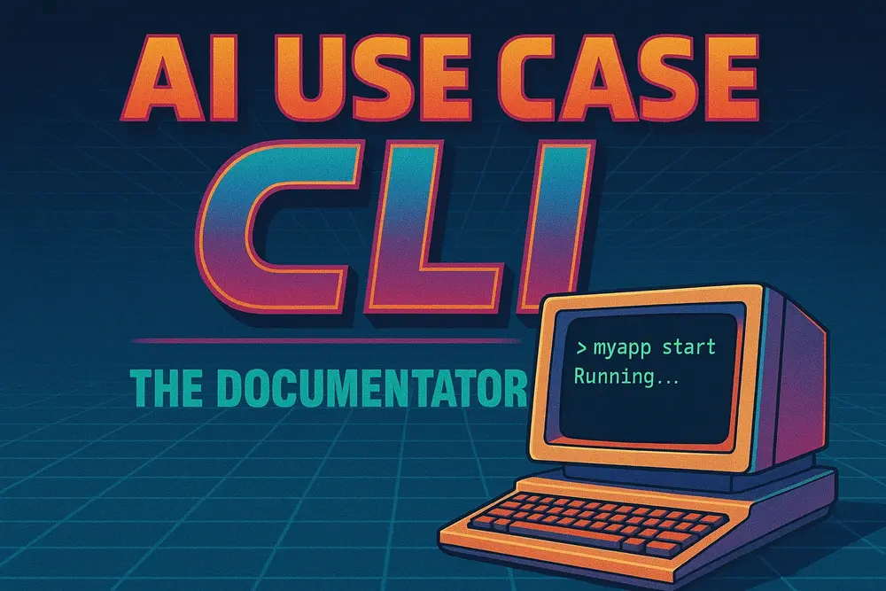

<div align="center">
    
    <h1>AI Use Case CLI</h1>
    <h3><em><strong>v3.1.0</strong> - Document AI-assisted development workflows with ease.</em></h3>
</div>

---

## Table of Contents

- 🎯 [Why This Tool?](#why-this-tool)
- ✨ [Features](#features)
- 📦 [Quick Install](#quick-install)
- 🚀 [Quick Start](#quick-start)
- 📖 [Usage](#usage)
- ⚙️ [How It Works](#how-it-works)
- 🔧 [Configuration](#configuration)
- 🗂️ [Project Registry (v3.1.0+)](#project-registry-v310)
- 💡 [Examples](#examples)
- 🔍 [Troubleshooting](#troubleshooting)
- 🔄 [Updates](#updates)
- 🚚 [Migration from v2.x](#migration-from-v2x)
- 🗑️ [Uninstall](#uninstall)
- 🤝 [Contributing](#contributing)
- 📋 [Requirements](#requirements)
- 💬 [Support](#support)
- 🔗 [Related Projects](#related-projects)
- 📄 [License](#license)

---

## Why This Tool?

Help developers on a daily basis by making AI session documentation effortless:

- **Reduce cognitive overload**: Pre-built templates eliminate the "what should I document?" paralysis
- **Build a knowledge base**: Create a searchable repository of successful AI interactions and solutions
- **Learn and improve**: Reference past sessions to understand what works and replicate success patterns
- **Stay organized**: Automatic syncing and categorization keeps your AI work documented and accessible

Documentation shouldn't be a burden—it should be a valuable asset that grows your team's AI expertise.

## Features

- 🎯 **Hybrid interface** - Use standalone CLI commands or Claude Code slash commands
- 🚀 **AI-assisted documentation** - Automatic context capture with Claude Code integration
- 🔬 **Research & implementation sessions** - Document both code changes and exploratory work
- 🔄 **Automatic syncing** - Git hooks sync docs to central hub automatically
- 🗂️ **Project registry** - Track and update all projects using the CLI (v3.1.0+)
- 🔍 **Search & stats** - Find and analyze documented use cases
- 📤 **Confluence publishing** - Publish use cases to Confluence as child pages

## Quick Install

```bash
curl -fsSL https://raw.githubusercontent.com/mt-osiris-tools/ai-use-case-cli/main/install.sh | bash
```

Or clone and install manually:

```bash
git clone https://github.com/mt-osiris-tools/ai-use-case-cli.git ~/.local/share/ai-use-case-cli
cd ~/.local/share/ai-use-case-cli
./install.sh
```

## Quick Start

1. **Setup your project**:
   ```bash
   ai-use-case --init
   ```

2. **Work on your code with AI assistance**

3. **Document your session** (in Claude Code):
   ```
   /use-case:document-session
   ```
   This automatically captures context, git changes, and generates complete documentation.

4. **Search and analyze**:
   ```bash
   ai-use-case search "authentication"
   ai-use-case stats
   ```

## Usage

### Core Commands

Use **either** standalone CLI or Claude Code slash commands—whatever fits your workflow:

| Task | CLI Command | Claude Code |
|------|-------------|-------------|
| Setup project | `ai-use-case --init` | `/use-case:setup-project` |
| Document session | N/A – use Claude Code | `/use-case:document-session` |
| Sync to hub | `ai-use-case sync` | `/use-case:sync-usecases` |
| Search use cases | `ai-use-case search <term>` | `/use-case:search-usecases` |
| View statistics | `ai-use-case stats` | |
| List projects | `ai-use-case list` | `/use-case:list-projects` |
| Check for updates | `ai-use-case check-updates` | `/use-case:check-updates` |
| Update project | `ai-use-case update-project <path>` | `/use-case:update-project` |
| Publish to Confluence | `ai-use-case publish-confluence` | `/use-case:publish-confluence` |
| View hub | `ai-use-case view` | |
| Push hub changes | `ai-use-case push` | |

### Additional Commands

```bash
ai-use-case --version     # Show version information
ai-use-case --help        # Show help message
ai-use-case uninstall     # Uninstall the CLI tool
```

### Session Types

The CLI supports two types of AI sessions:

**🎯 Implementation Sessions** - For code changes:
- Captures git statistics (files changed, lines added/removed)
- Includes code snippets and technical details
- Uses project-specific tickets (e.g., `PROJ-1234`)

**🔬 Research Sessions** - For exploration:
- No code changes required
- Documents query refinement and decision-making
- Auto-generates `RESEARCH-XXX` tickets

Examples: Evaluating architectures, comparing solutions, understanding codebases, investigating issues before fixing.

## How It Works

### Architecture

The CLI works with a separate documentation hub repository:

- **CLI Tools** (this repo): Scripts for documenting and managing use cases
- **Documentation Hub**: Central storage for all use case documents
  - Default: `~/Documents/ai-use-case-hub`
  - Repository: [ai-use-case-hub](https://github.com/mt-osiris-tools/ai-use-case-hub)
  - Organized by project, date, and topic using symlinks

### Workflow

1. **Setup**: Creates `docs/ai-use-cases/` in your project + installs git hooks
2. **Document**: `/use-case:document-session` automatically captures session details
3. **Sync**: Git hooks automatically sync to hub, commit, and push changes
4. **Organize**: Hub organizes docs by project, date, and topic

### File Naming Convention

```
YYYY-Www-MM-DD_TICKET-XXXXX_brief-description.md
```

Where `Www` is the ISO 8601 week number (W01-W53).

Examples:
```
2025-W44-11-03_PROJ-1234_implement-user-authentication.md
2025-W44-11-03_RESEARCH-001_evaluate-database-strategies.md
```

## Configuration

### Environment Variables

```bash
# Set custom hub location (optional, defaults to ~/Documents/ai-use-case-hub)
export AI_USECASES_DIR="$HOME/Documents/my-custom-hub"

# Ensure CLI is in PATH (usually handled by install script)
export PATH="$HOME/.local/bin:$PATH"
```

Add to `~/.bashrc` or `~/.zshrc` for persistence.

### Hub Setup

Clone the documentation hub:

```bash
cd ~/Documents
git clone https://github.com/mt-osiris-tools/ai-use-case-hub.git
cd ai-use-case-hub
git remote add origin <your-hub-repository-url>
```

Configure git remote to enable automatic pushing. Without a remote, changes are committed locally only.

## Project Registry (v3.1.0+)

The CLI now tracks all projects using the tool, enabling version management:

```bash
# List all registered projects with versions
ai-use-case list-projects

# Find projects needing updates
ai-use-case check-updates

# Update a specific project
ai-use-case update-project /path/to/project
```

Registry location: `~/.local/share/ai-use-case-cli/projects-registry.json`

## Examples

### Document a Bug Fix

In Claude Code, after fixing a bug with commits:

```
/use-case:document-session
```

Claude Code automatically extracts ticket from commits, analyzes git changes, captures conversation insights, generates complete documentation, and syncs to hub.

### Document Research Session

After exploring approaches without code changes:

```
/use-case:document-session
```

Claude Code detects no commits and creates a research session with auto-generated `RESEARCH-XXX` ticket.

### Publish to Confluence

```
/use-case:publish-confluence
```

Prerequisites: Atlassian MCP server configured, valid Confluence auth, page creation permissions.

## Troubleshooting

### CLI command not found

```bash
# Check PATH
echo $PATH | grep ".local/bin"

# Add to shell profile if missing
echo 'export PATH="$HOME/.local/bin:$PATH"' >> ~/.bashrc
source ~/.bashrc
```

### Hooks not syncing

```bash
# Check hook permissions
ls -la /path/to/project/.git/hooks/post-commit
chmod +x /path/to/project/.git/hooks/post-commit

# Test manual sync
ai-use-case sync
```

### Colors not rendering

If you see escape sequences like `\033[0;32m`, update to v2.1+ which uses proper ANSI color syntax.

## Updates

Check your version:

```bash
ai-use-case --version
```

Update to latest:

```bash
cd ~/.local/share/ai-use-case-cli && git pull
# OR: Re-run install script
curl -fsSL https://raw.githubusercontent.com/mt-osiris-tools/ai-use-case-cli/main/install.sh | bash
```

## Migration from v2.x

Good news! v3.1.0 restores all v2.x standalone CLI commands while adding Claude Code integration. No migration needed—your old commands still work!

For historical details on v3.0.0 breaking changes and migration steps, see [CHANGELOG.md](./CHANGELOG.md).

## Uninstall

```bash
ai-use-case uninstall
```

Removes symlink and optionally removes CLI directory and shell profile entries. Project-level setups remain intact.

## Contributing

We welcome contributions! This project follows a branch-based workflow with pull requests.

**Quick Start:**
1. Fork the repository
2. Create feature branch: `git checkout -b feature/amazing-feature`
3. Commit changes: `git commit -m 'feat: Add amazing feature'`
4. Update CHANGELOG.md
5. Push and open PR

See [CONTRIBUTING.md](./CONTRIBUTING.md) for complete guidelines.

## Requirements

- **OS**: Linux, macOS, WSL on Windows
- **Shell**: Bash 4.0+
- **Git**: For version control and hooks
- **Dependencies**: `realpath`, `find`, `grep` (standard Unix tools)

## Support

- **Issues**: [GitHub Issues](https://github.com/mt-osiris-tools/ai-use-case-cli/issues)
- **Discussions**: [GitHub Discussions](https://github.com/mt-osiris-tools/ai-use-case-cli/discussions)
- **Documentation**: [docs/](./docs/)

## Related Projects

- [ai-use-case-hub](https://github.com/mt-osiris-tools/ai-use-case-hub) - Documentation hub repository
- [Claude Code](https://claude.com/code) - AI coding assistant

## License

MIT License - see [LICENSE](./LICENSE) file for details

---

**Version**: 3.1.0
**Last Updated**: 2025-11-03
